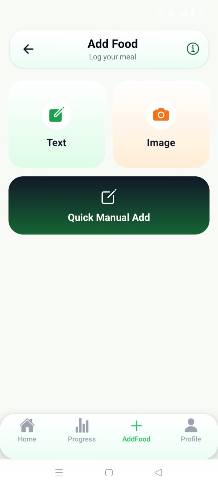
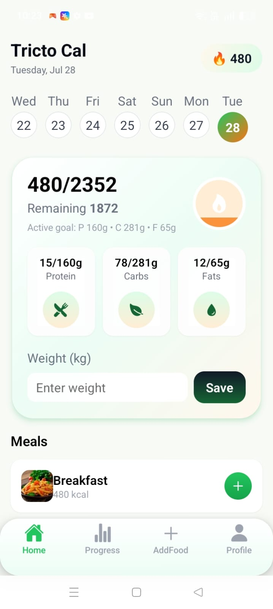
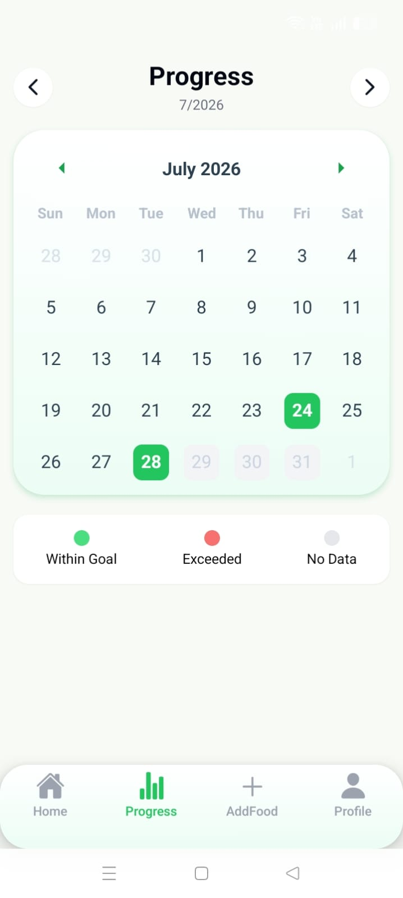

# TrictoCal AI

TrictoCal AI is an offline-first calorie and macro tracking mobile app built with Expo React Native. It helps users create a nutrition plan during onboarding, log meals manually or with AI-assisted prompts, track daily weight, and review progress through calendar-based history.

## Screenshots







## Features

- Guided onboarding for age, gender, height, weight, activity level, and goal
- Automatic daily calorie, protein, carbs, and fat goal calculation
- Home dashboard with daily calories, macros, meals, and weight logging
- Food logging by manual entry, text prompt, or food image prompt workflow
- Meal categories for Breakfast, Lunch, Snacks, and Dinner
- Calendar progress view for reviewing past food logs and weight entries
- Edit and delete logged food items from progress history
- Profile screen for updating goals and resetting local data
- Device-local persistence with Expo SQLite
- Optional Express server for direct food image analysis through ChatGPT or Gemini

## Tech Stack

- Expo 54
- React Native 0.81
- React 19
- TypeScript
- NativeWind and Tailwind CSS
- Expo SQLite
- React Navigation
- Expo Image Picker, Clipboard, Sharing, and Linear Gradient
- Express server for optional AI image analysis

## Project Structure

```text
.
├── App.tsx                  # App entry, DB initialization, onboarding flow
├── src/
│   ├── components/          # Shared UI components
│   ├── db/                  # SQLite setup and data services
│   ├── navigation/          # Bottom tabs and stack navigation
│   ├── screens/             # Home, Add Food, Progress, Profile, Onboarding
│   └── utils/               # Date helpers
├── server/                  # Optional Express AI analysis server
├── android/                 # Native Android project
├── ios/                     # Native iOS project
└── assets/                  # App icons and splash assets
```

## Prerequisites

- Node.js 18 or newer
- npm
- Expo CLI through `npx expo`
- Android Studio for Android builds
- Xcode and CocoaPods for iOS builds on macOS

## Install

Install the mobile app dependencies:

```bash
npm install
```

Install the optional server dependencies:

```bash
cd server
npm install
```

## Run the App

Start the Expo development server:

```bash
npm start
```

Run on Android:

```bash
npm run android
```

Run on iOS:

```bash
npm run ios
```

Run on web:

```bash
npm run web
```

## Optional AI Analysis Server

The app can be used without the server. The manual and prompt-copy workflows work offline, while direct image analysis requires internet access and an API key.

Start the server:

```bash
cd server
npm run dev
```

The server runs on port `8080` by default:

```text
http://localhost:8080
```

Health check:

```text
GET /health
```

Analyze endpoint:

```text
POST /analyze-image
```

Expected request body:

```json
{
  "provider": "chatgpt",
  "prompt": "Analyze this food image and return JSON.",
  "imageBase64": "...",
  "mimeType": "image/jpeg",
  "apiKey": "..."
}
```

Supported providers:

- `chatgpt`
- `gemini`

When testing on a physical device, use your computer's local network IP instead of `localhost`, for example:

```text
http://192.168.1.10:8080/analyze-image
```

## Available Scripts

Mobile app:

```bash
npm start
npm run android
npm run ios
npm run web
npm run lint
```

Server:

```bash
npm run dev
npm start
```

## Data Storage

The app stores food logs, daily summaries, user goals, goal history, and weight logs locally in an Expo SQLite database named `calorie.db`. AsyncStorage is used for onboarding completion state.

## Notes

- Future dates are blocked for food and progress logging.
- The app is designed to remain usable without an AI API key.
- API keys sent to the optional server are used for the current analysis request. For production, prefer storing secrets on a secure backend instead of sending user-provided keys from the app.
